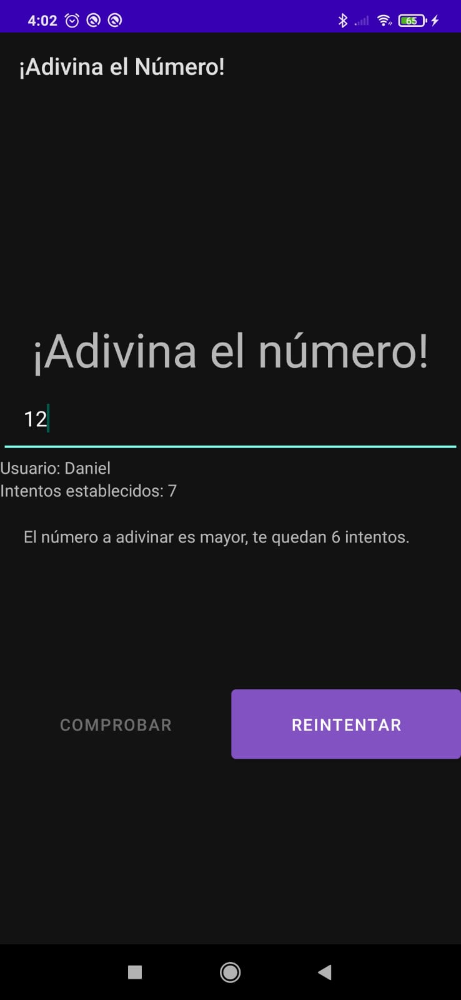

# Projecto 02 - Guess Number - Version Dynamic Fragment

## Información del proyecto

Este proyecto es un pequeño juego de adivinanza, en este tienes que descubrir el número aleatorio que se ha generado de forma automática en la cantidad de intentos que tu mismo dictes.
Al ser el mismo proyecto que el GuessNumber anterior solo que se cambia la forma de hacerlo (En vez de activity, con fragments). El readme va a ser prácticamente igual quitando los cambios
que trae de por sí los fragments.

## Característica del proyecto

Durante la realización de este proyecto hemos:
* Cambiado las activities por fragments
* Conectado los fragments a través de interfaces que gestiona una única activity
* Se ha usado el Toast para avisar de cuando era necesario la introducción de datos
* Se ha añadido icono de la app responsive
* Se ha añadido un recurso Drawable
* Se ha añadido los ciclos de vida de los fragments y de la activity
* Traducida la aplicación a inglés y coreano (Español por defecto)

## Novedades en el proyecto

Las novedades añadidas el projecto fuera de lo pedidos son:
* Traducido a un tercer idioma (Coreano)
* Icono personalizado
* Recurso Drawable
* Diseño más desarrollado

## Imágenes
> Programa instalado en nuestro dispositivo movil

> Config Activity (En español)

> Play Activity (En español)

> EndPlay Acitivity

> Versión Inglesa

> Versión Coreana

## Comentario personal sobre el proyecto

La conversión de activities a fragments la verdad que ha sido algo tedioso al principio al tener que mover todo el contenido de un 
proyecto a otro y luego cambiar cosas concretas para que se ajustaran a la configuración. Pero en sí el cambio de activity a fragment y usar las
transactions en vez de los intent ha sido bastante sencillo. Me ha parecido más limpio.

Lo único más dificil fue limpiar la pila de fragmentos que no me acordaba y encontre el código en internet.

El juego está capado en vertical porque no tiene mucho sentido en horizontal pero lo he comprobado y se guarda toda la información y
no crashea el programa. Lo único malo que al girarlas los componentes del fragment eran más grandes que la pantalla y se cortaban. He 
tratado de crear una versión land de todos los fragments para que se pusieran bien todos los componentes y se viera de formal normal, pero
no he conseguido que el android studio me detecte esos layouts al girarlos. Me seguia congiendo el layout principal en vertical y me lo giraba mal
y daba igual si los layouts estaban metidos o no en el layout-land. No se porqué no funcionaba. Así que lo he vuelto a capar como era desde un princpio
y ya.
